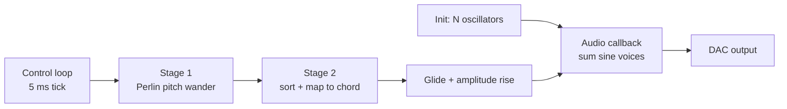
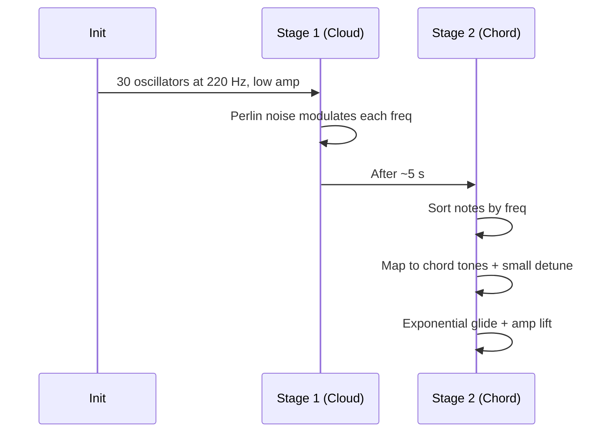

# Deep Note

A small Rust synth that recreates the THX Deep Note vibe by evolving a cloud of oscillators into a tight chord cluster. The core idea is simple: start with many detuned sines that wander in pitch, then sort and glide them into a harmonic structure.

## Signal Flow



## Implementation Stages



## Sorting and Mapping

The transition into the final chord is built from three steps:

```text
1) Collect current freqs (cloud)
2) Sort ascending
3) Map each index -> chord tone bucket
```

Mapping logic (from code):

```text
index_bucket = floor(i / NOTE_COUNT * chord_notes)
target_freq = chord[index_bucket] * random detune
```

This ensures low notes land on low chord tones and high notes land on high chord tones, preserving the spectral "rise" while locking into harmony.

## Core Techniques

- Additive synthesis: sum 30 sine oscillators per sample.
- Per-voice pitch drift: Perlin noise drives smooth wandering.
- Spectral ordering: sort by frequency before chord mapping.
- Exponential glide: smooth transition to the final harmonic set.

## Parameters Worth Tweaking

| Parameter | Role | Effect |
| --- | --- | --- |
| NOTE_COUNT | number of oscillators | density of the cloud |
| low/high | pitch range in stage 1 | depth and scale of the wander |
| transition | glide curve | snap vs slow bloom |
| base_freq / ratios | chord shape | final tone color |

## Run It

```bash
cargo run
```

## Files

- src/main.rs: entire synth and control loop
- Cargo.toml: dependencies

